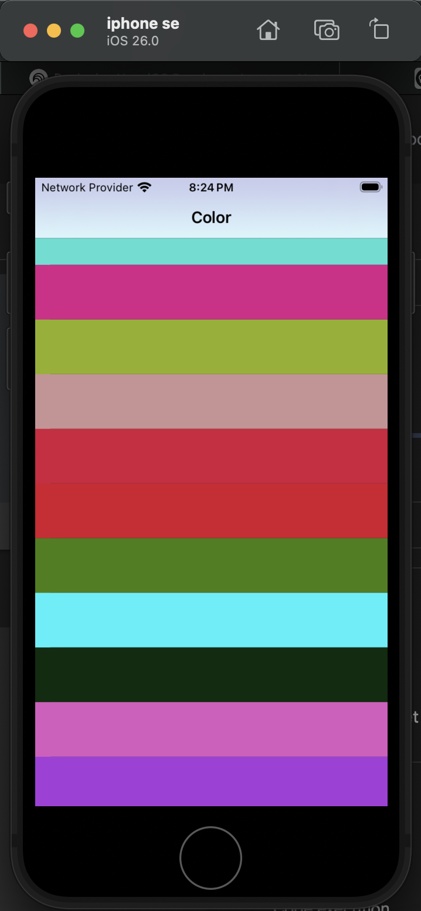

# Random Colors iOS App


A fundamental iOS application built using Swift and Storyboard. The app generates a list of 50 random colors and allows the user to tap on a color to see it fill a detail screen. It's a simple yet powerful project for demonstrating core iOS development concepts like Table Views, Navigation, and passing data between view controllers.

---

## 📸 App Preview

| Main Screen (Color List) | Detail Screen (Selected Color) |
| :----------------------: | :----------------------------: |
|  |  |

**App Running in Simulator:**


---

## ✨ Features

-   **Dynamic List**: Displays a `UITableView` populated with 50 unique, randomly generated colors.
-   **Master-Detail Navigation**: Utilizes a `UINavigationController` to manage the transition from the main color list to a detail view.
-   **Data Passing**: When a user selects a color from the list, that specific color data is passed to the next screen.
-   **Interactive UI**: The background color of the detail screen dynamically changes to match the color selected by the user.

---

## Core Concepts Demonstrated

This project serves as a practical guide to understanding several essential topics in iOS development:

-   **`UITableView`**: Setting up, providing data (`DataSource`), and handling interactions (`Delegate`) for list-based interfaces.
-   **`UINavigationController`**: Managing a stack of view controllers to create a navigational hierarchy.
-   **Storyboard & Segues**: Visually designing the UI and defining the transitions (`show` segue) between screens.
-   **View Controller Lifecycle**: Using `viewDidLoad()` to prepare data and configure the initial state of a view.
-   **Data Flow**: Passing data forward from one view controller to another using the `prepare(for:sender:)` method.
-   **Swift Fundamentals**:
    -   `Arrays`: Storing the collection of `UIColor` objects.
    -   `For Loops`: Programmatically generating the list of 50 colors.
    -   `Extensions`: Adding custom functionality to existing Cocoa Touch classes.

---

## ⚙️ How It Works

### 1. Data Generation & Storage

-   A `var colors: [UIColor] = []` array is declared in the main `ColorsTableVC` to act as the data source for the list.
-   A helper function generates a random `UIColor` by creating random `CGFloat` values for the red, green, and blue color channels.
-   In `viewDidLoad()`, a `for` loop runs 50 times, calling the random color function and appending each new `UIColor` to the `colors` array.

### 2. Table View Implementation

-   The `ColorsTableVC` conforms to `UITableViewDataSource` and `UITableViewDelegate`.
-   `tableView(_:numberOfRowsInSection:)` returns `colors.count` to tell the table view how many rows to create.
-   `tableView(_:cellForRowAt:)` is responsible for configuring each cell. It dequeues a reusable cell and sets its `backgroundColor` to the color from the array at the given index path (`colors[indexPath.row]`).

### 3. Navigation and Data Passing

1.  **Triggering the Segue**: The `tableView(_:didSelectRowAt:)` delegate method is triggered when a user taps a cell. This method calls `performSegue(withIdentifier:sender:)`.
    -   The `withIdentifier` parameter is a unique string defined in the Storyboard for the segue leading to the detail screen.
    -   The `sender` parameter is used to pass the selected color object: `colors[indexPath.row]`.

2.  **Preparing the Data**: Before the transition occurs, `prepare(for:sender:)` is called.
    -   It accesses the destination view controller (`segue.destination`) and casts it to our `ColorsDetailVC` class.
    -   It then sets a `color` property on the `ColorsDetailVC` instance, assigning it the value passed in the `sender` parameter.

3.  **Displaying the Data**:
    -   The `ColorsDetailVC` has a `var color: UIColor?` property to receive the data.
    -   In its `viewDidLoad()`, it sets its main view's background color to this passed `color`, effectively changing the screen to match the user's selection.

---

## 🚀 Code Refinements & Best Practices

### `UIColor` Extension

To promote code reusability and adhere to the Don't Repeat Yourself (DRY) principle, the random color generation logic is not kept inside the View Controller. Instead, it's moved into a `static func` within an extension on `UIColor` itself.

**`UIColor+EXT.swift`**
```swift
import UIKit

extension UIColor {
    static func random() -> UIColor {
        let randomColor = UIColor(red: CGFloat.random(in: 0...1),
                                  green: CGFloat.random(in: 0...1),
                                  blue: CGFloat.random(in: 0...1),
                                  alpha: 1)
        return randomColor
    }
}
